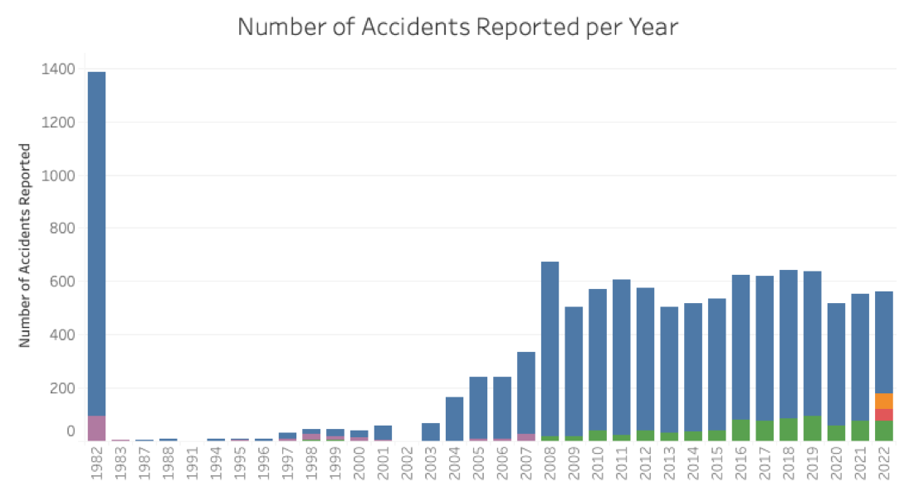
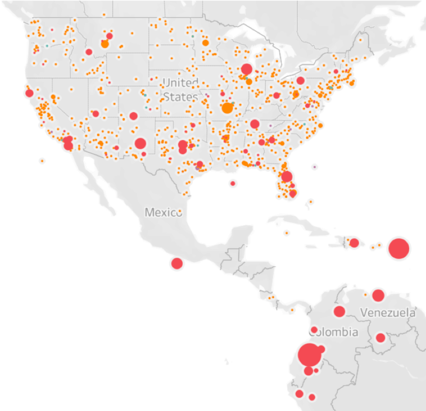
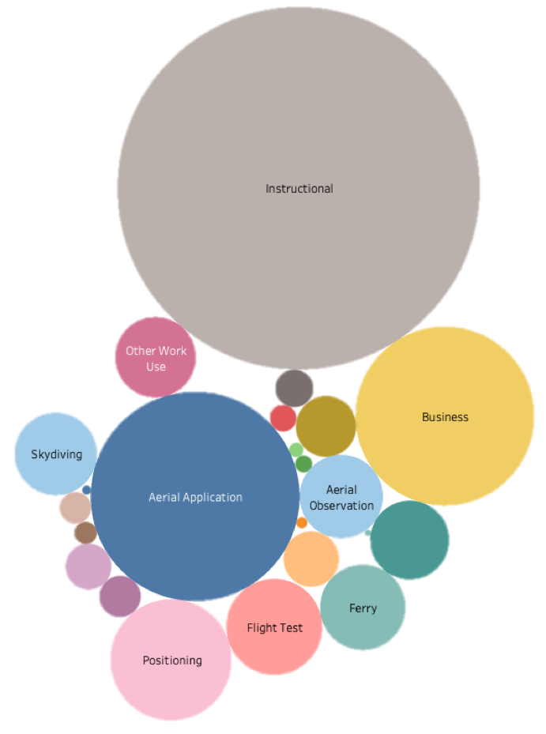
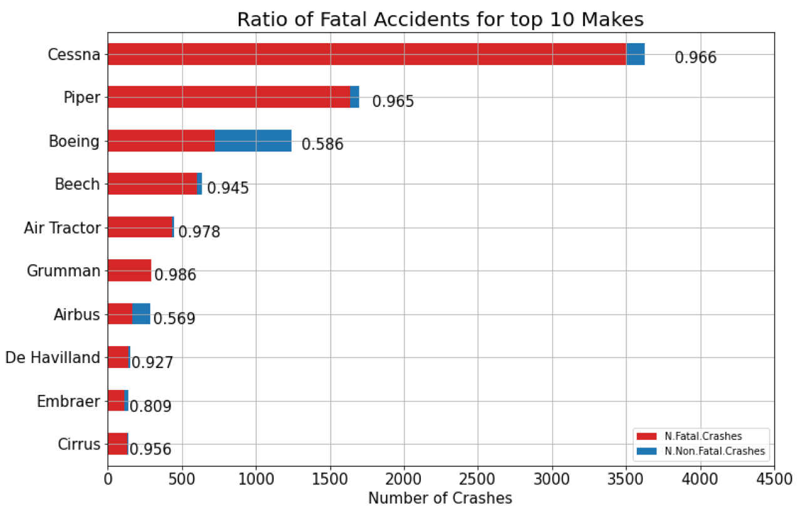
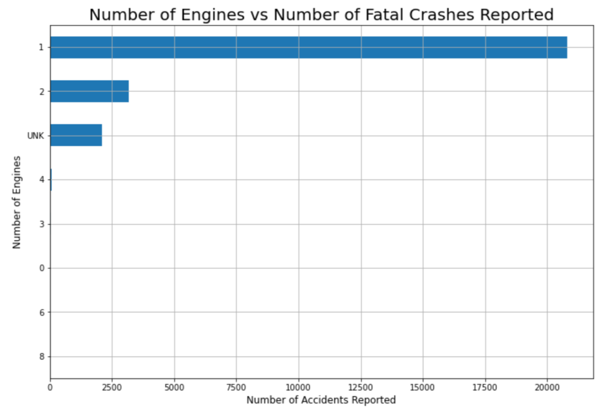

# Phase 1 Project
This is the repository that contains all files associated with the DS Flex Phase 1 Project.

## Project Overview

In this project, we utilized data cleaning, analysis, and visualization to investigate trends in airplane accidents from 1963-2023 and generate insights. 

### Business Problem

A company is interested in expanding it's portfolio into private and commercial airplane operation. Before investing in any planes, they need to know the risks associated with airplane travel, the safest airplane models, the safest airplane sizes, and the riskiest aviation uses. The results are summarized in a presentation and interactive dashboard suitable to be presented to a non-techinical audience and ???translated??? to make clear business recommendations.

### The Data

In the `data` folder is a [dataset](https://www.kaggle.com/datasets/khsamaha/aviation-accident-database-synopses) from the National Transportation Safety Board that includes aviation accident data from 1962 to 2023 about civil aviation accidents and selected incidents in the United States and international waters. This data set is saved as 'Aviation_Data.csv'

Figure 1: Number of accidents reported per year after filtering.

Figure 2: Locations of accidents reported per year
   - size = number of fatalities
   - red = aircraft destroyed
   - orange = severe aircraft damage

There are 5 additional data sets generated by filtering and organizing the given data set for specific insights:
   - filtered_data.csv: the Avation_Data.csv after being filtered, checked for missing data, and formatted.
   - fatal_data.csv: A dataset containing the fatality counts and ratios for each airplane make.
   - airbus_data.csv: a subset of filtered_data.csv pertaining only to Airbus models. includes the fatality ratio for each model
   - boeing_data.csv: a subset of filtered_data.csv pertaining only to Boeing models. includes the fatality ratio for each model

### Analysis
The primary analysis work can be found in the jupityer notebook 'data_analysis.ipynb'
 

Data Cleaning:
   - filtered out all data not related to airplanes
   - filtered out all data for personal and military flights
   - replaced or removed all missing or incomplete dta
   - standardized formatting

Data Anaysis:
   - Determine the purposes of flight that resulted in the most crashes
   
   - Determine the fatality ratio for the top 10 manufactures
   

   - Determine the models with the lowest fatality ratios
   - Determine the airplane size with the highest number of fatal crashes (use number of engines as a shorthand for airplane size)
     

### Visualizations Dashboard
Additional visualizations can be found in an interactive dashboard on Tableau Public: : https://public.tableau.com/app/profile/abigail.campbell7330/viz/Project1_16892855385460/Dashboard1?publish=yes

## Recommendations
The analysis conlusions are outlined in a non-technical presentation found in this repository under 'Project1_presentation.pptx'

Summary of the primary conclustions:
   1. Avoid Instructional and Aerial Applications
   2. Boeing and Airbus have the best safety record
         - Best models: Boeing 727 & 787,  Airbus A300 & A320
   3. Avoid single engine planes

